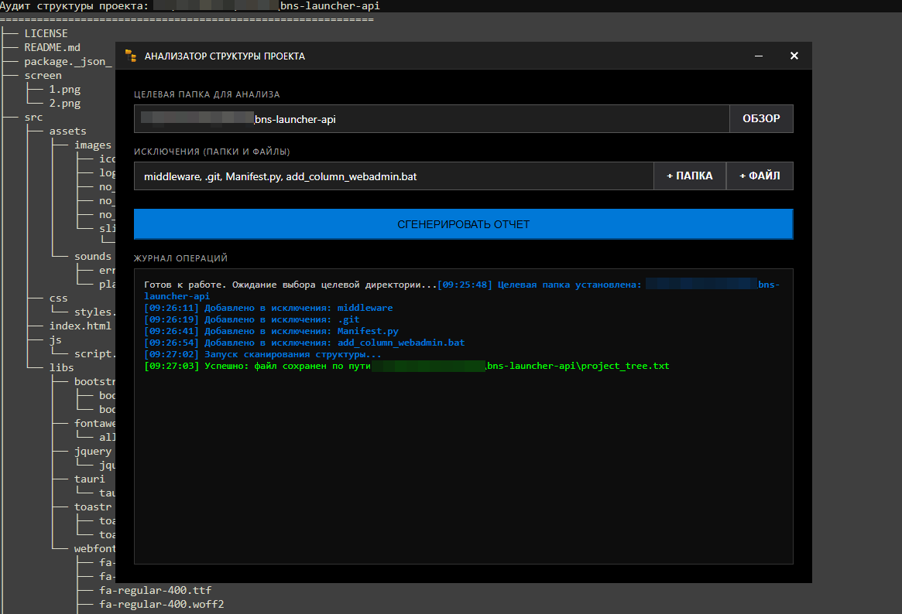

# Project Tree Analyzer

Легковесное нативное десктопное приложение для аудита и генерации дерева структуры файлов проекта. Построено на **Rust + Tauri**, работает полностью автономно и **не требует** установки Node.js, npm или тяжелых JS-фреймворков.



## ⚡ Ключевые особенности
- **Максимальная производительность:** Сканирование директорий на чистом Rust обеспечивает мгновенный отклик и минимальное потребление ресурсов.
- **Metro UI интерфейс:** Строгий, профессиональный дизайн в стиле Windows без скруглений, с кастомным заголовком окна и нативным управлением.
- **Гибкая фильтрация:** Возможность выборочного исключения конкретных папок и файлов (например, `node_modules`, `.git`, `target`) через удобные системные диалоги.
- **Нулевые веб-зависимости:** Фронтенд написан на чистом HTML/CSS/JS.
- **Чистый релиз:** Скомпилированный `.exe` файл запускается без фонового консольного окна.

## 📂 Структура проекта
```text
├── build.bat                 # Скрипт чистой сборки релиза (автоматически выполняет cargo clean)
├── dev.bat                   # Скрипт запуска режима разработки с поддержкой hot-reload
├── src
│   ├── icon.png              # Иконка приложения для отображения в интерфейсе и вкладке
│   └── index.html            # Фронтенд приложения (единый файл с логикой и стилями)
└── src-tauri
    ├── Cargo.lock
    ├── Cargo.toml            # Зависимости Rust (автор: WAR100CK)
    ├── build.rs              # Скрипт сборки Tauri
    ├── icons
    │   └── icon.ico          # Системная иконка для Windows (заголовок окна и панель задач)
    ├── src
    │   └── main.rs           # Бэкенд: логика рекурсивного сканирования и записи дерева файлов
    └── tauri.conf.json       # Конфигурация окна (frameless), разрешений и путей сборки
```

## 🛠 Требования для сборки
1. Установленный [Rust](https://www.rust-lang.org/tools/install) (toolchain: stable).
2. Установленный [Tauri CLI](https://tauri.app/v1/guides/getting-started/prerequisites):
   ```bash
   cargo install tauri-cli --version "^1.6.6"
   ```
3. *(Опционально)* Для генерации `.ico` из PNG: `cargo tauri icon src/icon.png`

## 🚀 Использование

**Режим разработки:**  
Запустите файл `dev.bat`. Приложение откроется в режиме отладки. Любые изменения в `src/index.html` или `src-tauri/src/main.rs` будут автоматически подхватываться.

**Сборка финальной версии:**  
Запустите файл `build.bat`. Скрипт автоматически очистит папку `target` от старых артефактов и скомпилирует оптимизированный релиз.

Готовый исполняемый файл будет доступен по пути:  
`src-tauri\target\release\project-tree-analyzer.exe`  
*(Установочные пакеты MSI/NSIS формируются в папке `src-tauri\target\release\bundle\`)*

## 📄 Лицензия
MIT License. Автор: WAR100CK.